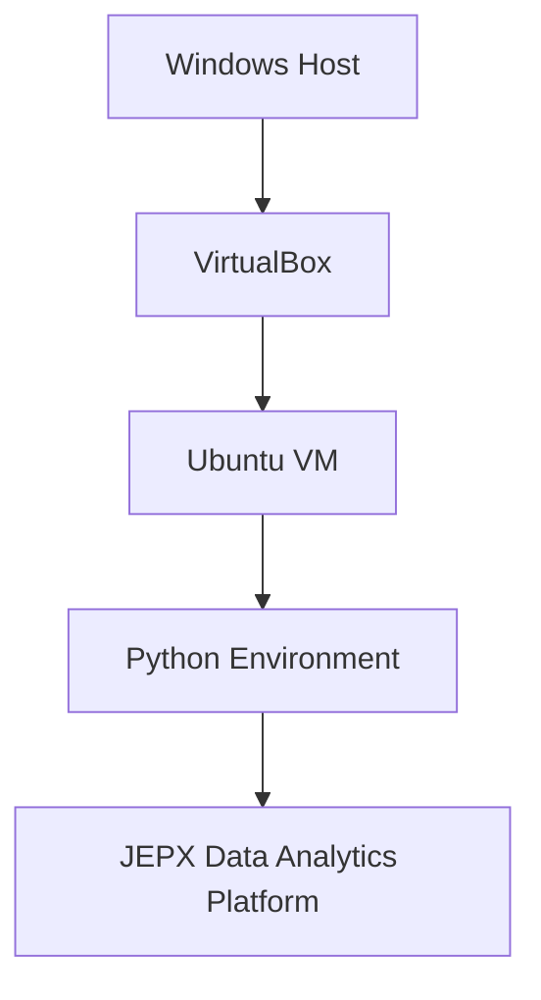
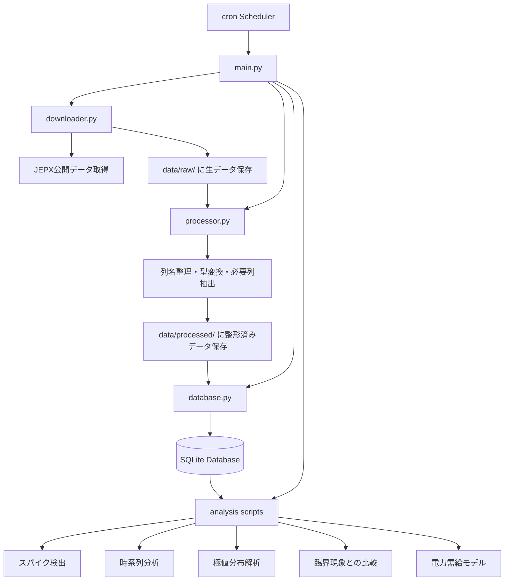
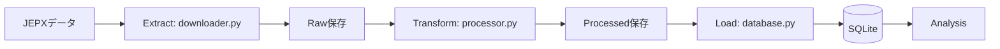
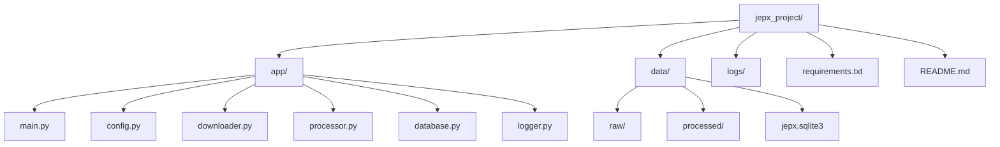
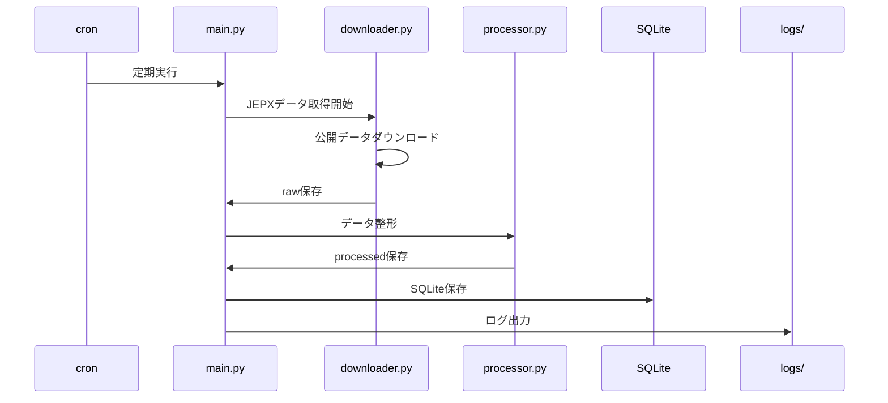
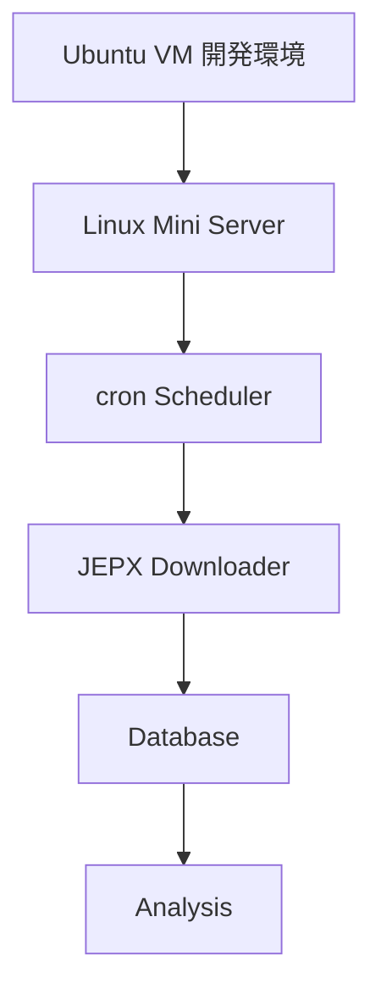
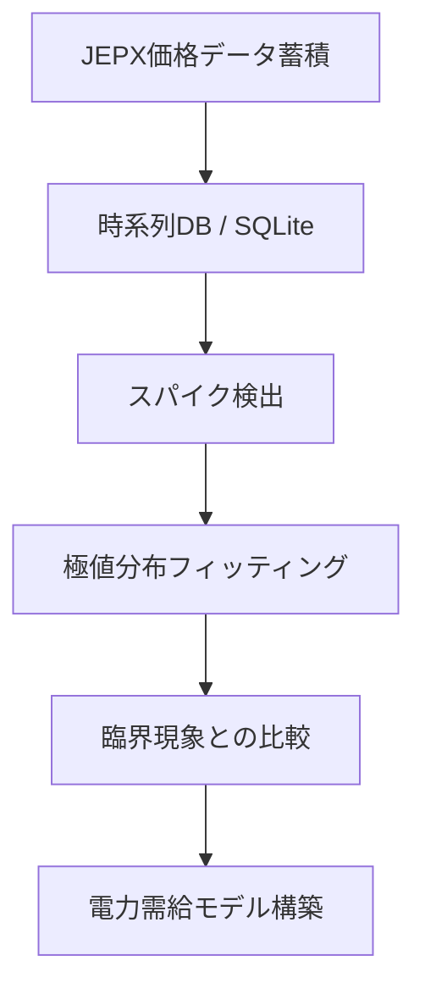

# jepx-data-analytics-platform

JEPX（日本卸電力取引所）の電力価格データを収集・蓄積・分析し、  
電力価格スパイクの統計的性質を研究するためのデータ分析基盤。

最終的な研究テーマ：

```
JEPX価格
↓
スパイク検出
↓
極値分布
↓
臨界現象
↓
電力需給モデル
```

---

# 1. 開発環境アーキテクチャ

本プロジェクトは **Windowsホスト + Ubuntu VM** 上で開発する。



この構成により以下を実現する。

- Linuxサーバー環境での開発
- cronベースのバッチ処理
- 将来のLinuxサーバー・クラウド移行

---

# 2. 全体アーキテクチャ



---

# 3. ETLの流れ



---

# 4. ディレクトリ構成と責務



---

## 各ファイルの責務

### main.py
全体の実行制御を担当するエントリポイント

### config.py
URL、保存先、DB名など設定値を管理

### downloader.py
JEPXデータの取得と raw 保存

### processor.py
生データ整形

- 列整理
- 型変換
- 必要列抽出

### database.py
SQLite保存処理

- テーブル作成
- 重複制御

### logger.py
ログ設定

---

# 5. Phase A 実行フロー（Ubuntu VM）



---

# 6. 将来の運用アーキテクチャ

Ubuntu VMで完成したシステムを  
**ミニPC Linux サーバーへ移植する。**



---

# 7. 長期研究アーキテクチャ



---

# 8. 将来拡張アーキテクチャ


---

# 9. アーキテクチャ設計方針

本プロジェクトでは以下の設計原則を採用する。

### 1. 責務分離
取得・整形・保存・分析を分離する

### 2. Linuxサーバー前提設計
開発環境は Ubuntu VM を使用

### 3. cronベースのバッチ処理
定期実行は Linux cron で制御

### 4. 移植性を重視
将来的に

```
Ubuntu VM
↓
Linuxミニサーバー
↓
クラウド
```

へ移行可能な設計とする。

### 5. 研究基盤として設計
単なる取得ツールではなく

- スパイク検出
- 極値統計
- 臨界現象解析

につながるデータ基盤として設計する。