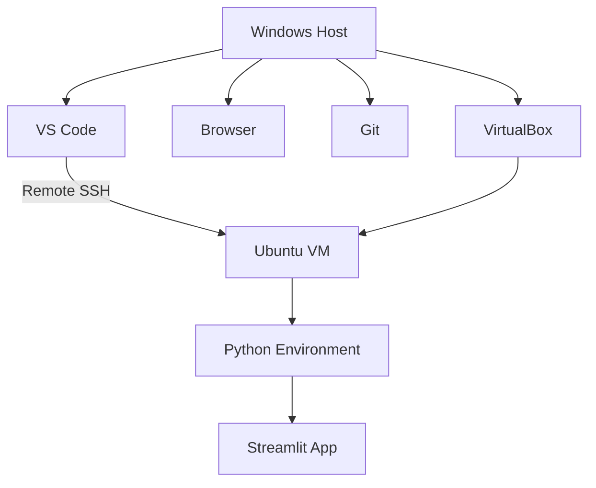
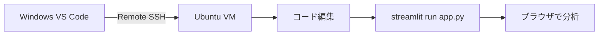
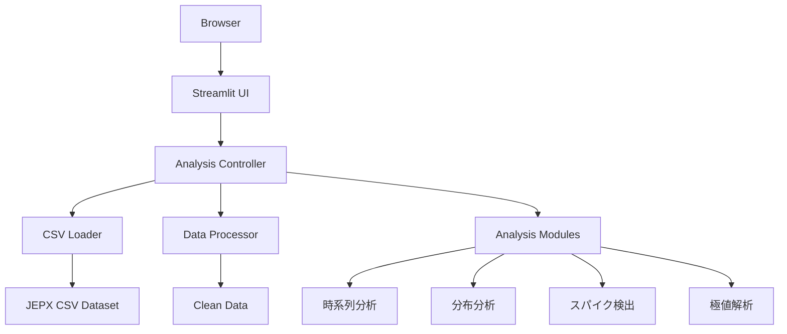
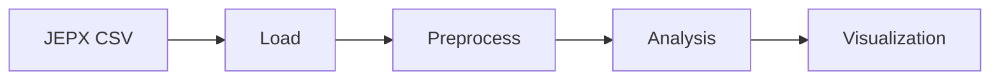
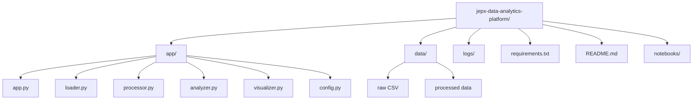
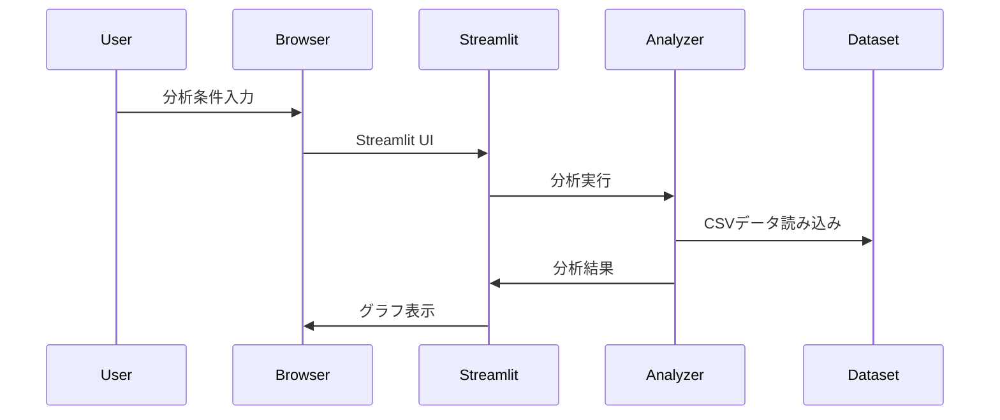
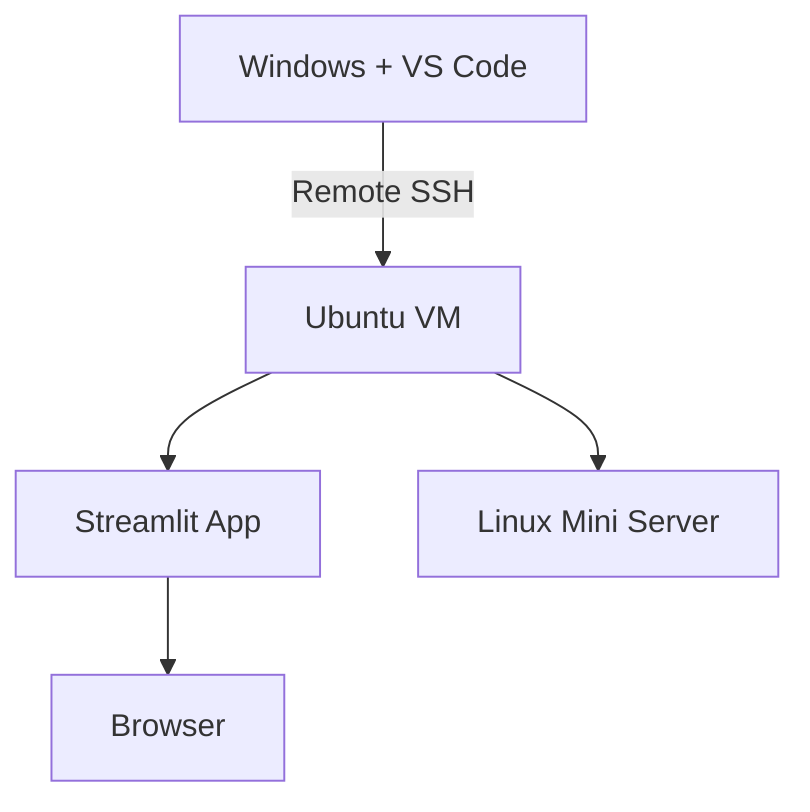
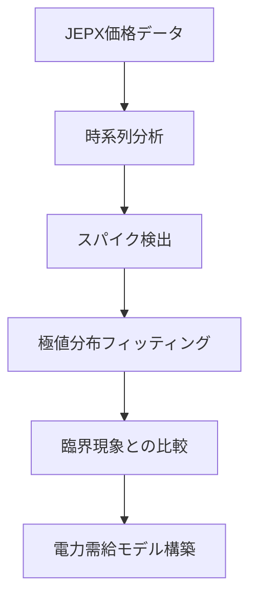
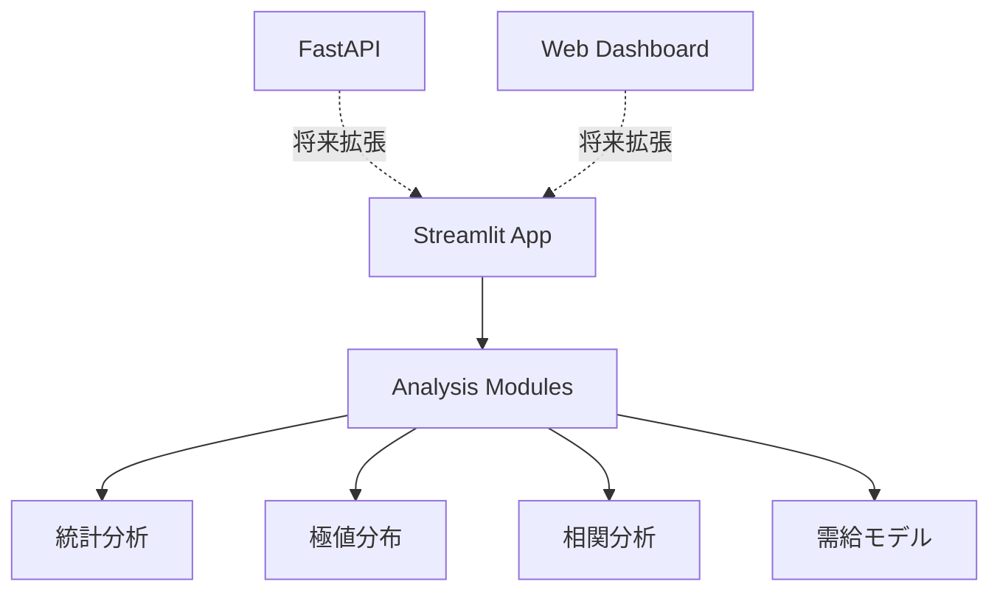

# jepx-data-analytics-platform

JEPX（日本卸電力取引所）の電力価格データを分析する  
インタラクティブ分析アプリケーション。

JEPXが公開している年度CSVデータを読み込み、

- 任意期間
- エリア
- 分析手法

を指定して、ブラウザ上から電力価格分析を行う。

本アプリは、電力価格スパイクの統計的性質を研究するための  
**分析プラットフォーム**として設計している。

---

# 研究テーマ

最終的な研究テーマ：

```text
JEPX価格
↓
スパイク検出
↓
極値分布
↓
臨界現象
↓
電力需給モデル
```

---

# 1. 開発環境アーキテクチャ

本プロジェクトは **Windowsホストで開発し、Ubuntu VM を実行環境として使用する。**  
コード編集は **VS Code + Remote SSH** を用いて、Ubuntu VM 上のプロジェクトを直接編集する。



この構成により以下を実現する。

- Windows上の快適な開発環境
- Linuxサーバー環境での実行
- VS Code から Ubuntu VM への直接開発
- Streamlit によるローカル分析アプリ
- 将来の Linux サーバー・クラウド移行

---

# 2. 開発フロー

本プロジェクトの基本的な開発フローは以下である。



実務イメージとしては次に近い。

```text
開発PC
↓
SSH
↓
Linuxサーバー
↓
アプリ実行
```

---

# 3. 全体アーキテクチャ



---

# 4. データ分析フロー



---

# 5. ディレクトリ構成と責務



---

## 各ファイルの責務

### app.py
Streamlitアプリ本体  
UIと分析実行を管理

---

### loader.py
JEPX CSV読み込み

- CSVロード
- pandas DataFrame化

---

### processor.py
データ整形

- 列整理
- 日付変換
- 欠損処理

---

### analyzer.py
分析ロジック

- 時系列分析
- 分布分析
- スパイク検出
- 極値解析

---

### visualizer.py
グラフ描画

- matplotlib / plotly

---

### config.py
設定管理

---

# 6. アプリ実行フロー



---

# 7. 将来の運用アーキテクチャ

Ubuntu VMで開発したアプリを  
**ミニPC Linux サーバーへ移植する。**



---

# 8. 長期研究アーキテクチャ



---

# 9. 将来拡張アーキテクチャ



---

# 10. アーキテクチャ設計方針

本プロジェクトでは以下の設計原則を採用する。

### 1. 責務分離
データ読み込み・整形・分析・可視化を分離する

### 2. 開発環境と実行環境の分離
Windows を開発母艦、Ubuntu VM を実行環境とする

### 3. Streamlitによる分析アプリ
Pythonコードを書かずに分析可能なUIを提供する

### 4. Remote SSH による開発
VS Code から Ubuntu VM に接続し、Linux 上のファイルを直接編集する

### 5. 移植性を重視
将来的に

```text
Ubuntu VM
↓
Linuxミニサーバー
↓
クラウド
```

へ移行可能な設計とする。

### 6. 研究基盤として設計
単なる分析ツールではなく

- スパイク検出
- 極値統計
- 臨界現象解析

につながる分析基盤とする。