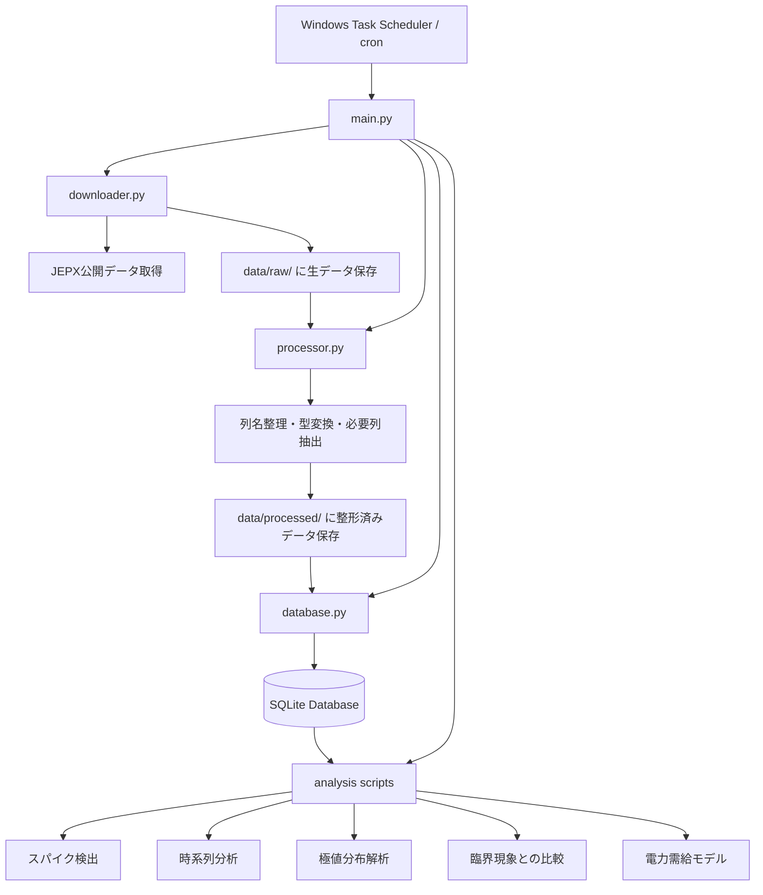
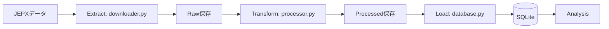
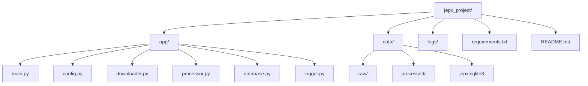
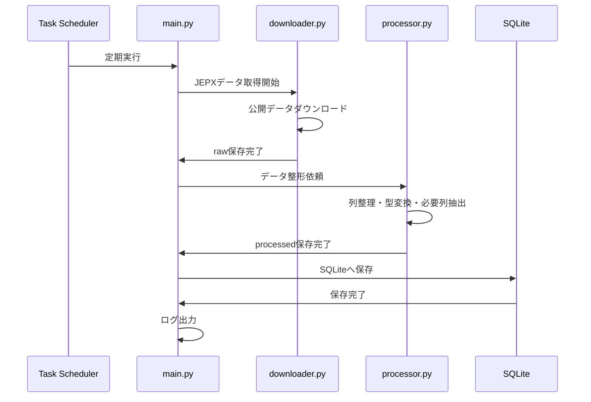
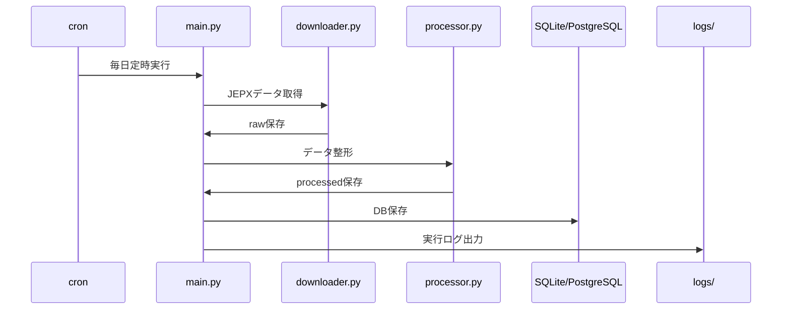
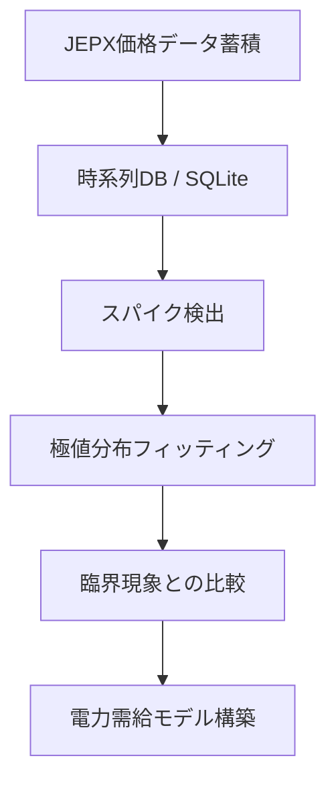
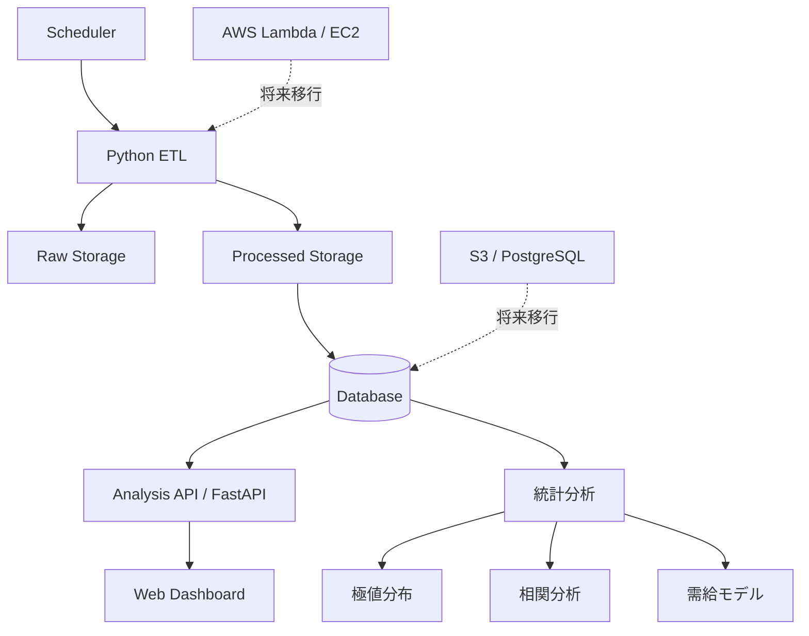

# jepx-data-analytics-platform
## 1. 全体アーキテクチャ

---

## 2. ETLの流れ

---

## 3. ディレクトリ構成と責務

### 各ファイルの責務

- `main.py`  
  全体の実行制御を担当するエントリポイント

- `config.py`  
  URL、保存先、DB名など設定値を管理する

- `downloader.py`  
  JEPXデータの取得と raw 保存を担当する

- `processor.py`  
  生データの整形、列整理、型変換、必要列抽出を担当する

- `database.py`  
  SQLiteへの保存、テーブル作成、重複制御を担当する

- `logger.py`  
  ログ出力設定を担当する

---

## 4. Phase A の実行フロー（Windowsローカル）

---

## 5. Phase C の実行フロー（ミニPC + Linux）

---

## 6. 長期研究アーキテクチャ

---

## 7. 将来拡張アーキテクチャ

---

## 8. アーキテクチャ設計方針

このプロジェクトでは以下の設計方針を採用する。

1. **責務分離**  
   取得、整形、保存、分析を分離する

2. **ローカル完結で開始**  
   まずはWindowsローカルで完成させる

3. **Linux移植を前提に設計**  
   `pathlib`、設定分離、ログ管理により移植性を高める

4. **将来のクラウド化を阻害しない**  
   スケジューラとアプリ本体を分離し、保存先も差し替え可能にする

5. **研究基盤として育てる**  
   単なる取得ツールではなく、スパイク検出・極値統計・臨界現象解析につながる基盤とする